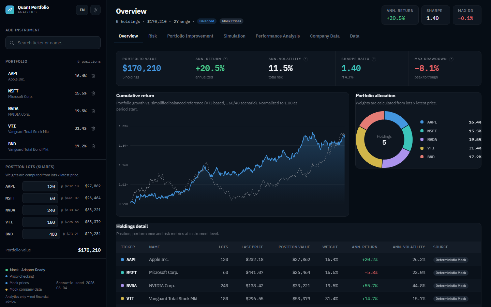
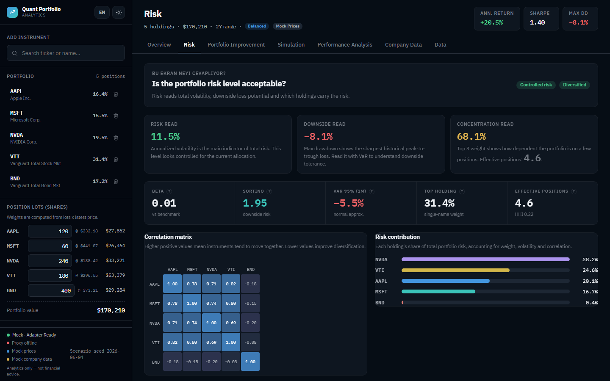

# QPA: Quant Portfolio Analytics

Interactive portfolio analytics and risk-monitoring dashboard with market-data
fallbacks, Monte Carlo simulation, optimization scenarios, and Playwright E2E
coverage.

[](https://portfolio-analytics-dashboard-three.vercel.app/)
[](https://github.com/Tuluntas09/portfolio-analytics-dashboard/actions/workflows/ci.yml)
[](https://react.dev)
[](https://vitejs.dev)
[](https://playwright.dev)
[](LICENSE)

## 30-Second Scan

| Area | What this project shows |
|---|---|
| Product | Multi-tab portfolio analytics app with overview, risk, optimization, Monte Carlo, performance, company data, and data-quality views |
| Finance | Volatility, Sharpe, Sortino, max drawdown, VaR/CVaR, beta, correlation, risk contribution, stress scenarios |
| Engineering | React/Vite frontend, Node.js market-data proxy, server-side API key handling, cache/retry/rate-limit controls |
| Reliability | Deterministic mock fallback, data-source labels, proxy health checks, and Playwright E2E coverage |
| Deployment | Public Vercel demo plus local/offline mode for reproducible review |

> Educational analytics only. Optimization outputs are hypothetical model
> scenarios, not investment advice or buy/sell recommendations.

## Live Demo

Open the deployed app:
[portfolio-analytics-dashboard-three.vercel.app](https://portfolio-analytics-dashboard-three.vercel.app/)

## Preview

| Overview | Risk Analytics |
|---|---|
|  |  |

## Key Features

- Portfolio overview with allocation, position values, growth chart, benchmark comparison, and attribution.
- Risk analytics covering volatility, Sharpe, Sortino, max drawdown, VaR, CVaR, beta, correlation, and risk contribution.
- Optimization scenarios for max-Sharpe and minimum-risk allocations.
- Monte Carlo simulation with configurable horizon, fan chart, and terminal distribution.
- Performance analysis with rolling metrics, rebalancing comparison, and stress-test scenarios.
- Company data panel with Finnhub profile, quote, and recent news per holding.
- Data quality panel showing provider, fallback path, proxy health, and history length.
- CSV import/export, saved portfolios, portfolio notes, snapshots, JSON backup/restore, and print/PDF report flow.

## Tech Stack

| Layer | Tools |
|---|---|
| Frontend | React 18, Vite 7, CSS custom properties |
| Backend proxy | Native Node.js HTTP server |
| Market data | Finnhub REST API, Yahoo Finance chart fallback |
| Offline mode | Deterministic synthetic price engine |
| Testing | Node.js smoke checks, Playwright Chromium E2E |
| Deployment | Vercel |

## Local Setup

```bash
npm install
npm run dev
```

Optional market-data proxy:

```bash
cp .env.example .env
# Add FINNHUB_API_KEY=your_key_here
npm run api
```

Open `http://127.0.0.1:8502`.

## Validation

```bash
npm run build
npm run test:smoke
npm run test:e2e
```

The app remains usable without an API key through deterministic mock data. The
UI labels data state as `Mock Prices`, `Partial Prices`, or `Real Prices`.

## Documentation

- [Financial metrics](docs/FINANCIAL_METRICS.md)
- [Data quality model](docs/DATA_QUALITY_MODEL.md)
- [Deployment notes](docs/DEPLOYMENT.md)
- [Local daily use](docs/LOCAL_DAILY_USE.md)
- [Storage schema](docs/STORAGE_SCHEMA.md)

## License

MIT License. See [LICENSE](LICENSE).
